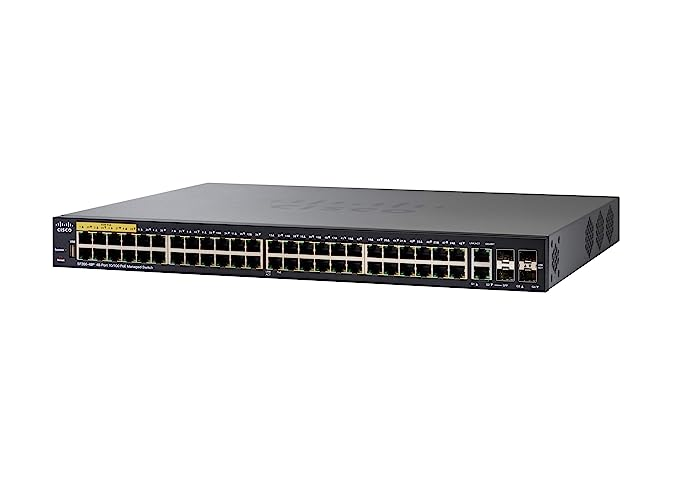
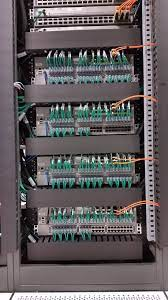

# Networking 

AWS initial lecture we saw VPC is created with network of 10.0.0.0/16 and subnets are created for each zone. We will discuss what is meant by subnets in this chapter. 

## Addresses

Each computer on the network needs address to communicate with each other. There is a particular format to give address, it is 32 bit address and it looks like 10101111110000101101111000001011 and in decimal for the above address is 2948783627. 

 1. It is impossible to remember 32 bit binary or decimal number
 2. We split 32 bits into 4 8 bits binary 10101111 11000010 11011110 00001011 and dot between them instead of space.
 3. The above number now is 175.194.222.11
 4. Each 8 bits maximum it can have is 255 (if all the bits are one's)

If two hosts has addresses 172.16.1.190 and 210.211.14.189 and needs to communicate each other is a huge problem because each host need to maintain $2^{32}$ addresses. Similar to PIN code where one whole area gets single pinched, we divided 32 bit address to network part and host part.

 - 172.16.100.0/24 means first 24 bits belong to network. 172.16.100 is part of network and you can host host address from 1 to 255. (255 can't be assigned we cover later).
 - 10;0.0.0/8 means you can have addresses from 10.1.1.1 to 10.255.255.255
 
# LAN

Office or home office has 5-200 computers, one will buy single switch (with 24 or 48 network ports) or few of switches and arranged in a rack.

A rack of switches

 - Hosts in a stack of switches can't have address like 172.16.100.120 and 192.168.1.20
 - All addresses of hosts connected to the above switch or rack of switches need to have same subnet meaning like 172.16.100.0/24 range only. It can have 172.16.100.1 to 172.16.100.254
 - All hosts in that range we call it same broadcast address. The broadcast address is 172.16.100.255 (so it is reserved address)
 - No need of any routing to communicate with in subnet. Host sends traffic to switch, switch routes it to the correct host.
 - Each node we have to identify free IP address and assign IP address to the host (How this process will be simplified we cover in later sections)
 - We need to manage table of hosts<---> Ip address table 

# Divide LAN

We have lan with 172.16.100.0/24 address and 254 hosts can be arranged. We would like to split administrative network and business network.
172.16.100 is fixed as it is part of network. We have 00000000 (8 of them) in our control and divide fixing first one zero 0XXXXXXX or fixing first one as one 1XXXXXXX. 
172.16.100.0XXXXXXX - One subnet
172.16.100.1XXXXXXX - Another subnet
172.16.100.1..127 network has 25 bits network and 7 bits for hsot
172.16.100.128..255 is another network

We call such network 172.16.100.0/25 subnet (two of such one with leading zero and another leading one).
Divide switches and no interconnection for one subnet to another subnet.
172.16.100.22 host can communicate to 172.16.100.101 host
172.16.100.145 host can communicate to 172.16.100.222 host

How to make communication from one LAN to and another LAN (Here LAN or local area network is loosely used rather 172.16.100.0/25 networks)

 1. Interconnect switches of 172.16.100.0/25 to 172.16.100.1/25
 2. One switch has address 172.16.100.1 and another has 172.16.100.128 interconnect

Interconnection of switches are not enough, you need to provide something on each host.

 - Host can communicate with in broadcast address, outside of the broadcast address they can't communicate
 - 172.16.100.15 host communication with 172.16.100.145 (two different broadcast addresses). Send data to 172.16.100.1 to communicate to 172.16.100.1/25 addresses
 - 172.16.100.198 can communicate to 172.16.100.19 via 172.16.100.128 only
 - 172.16.100.1 and 172.16.100.128 can forward to other networks
 - Routing table entry on each 172.16.100.0/25 network is route add 172.16.100.128/25 gw 172.16.100.1
 - This is also called routing table.
 - If we have more complex routes routing table has more entries
 - All routing table entries are very complex and one IP changes we need to modify on each node.

## Default gateway and DHCP

Many a times we may not have complex subnets, hosts need to communicate any other node outside of the broadcast address.
We add route add 0.0.0.0/0 gw 172.16.100.1
What this routing entry saying is any thing other than 172.16.100.x broadcast address send it to 172.16.100.1. We call this gateway default gateway as it is default route.
We covered all aspects but how the name resolution happens? How does www.google.co.in translates to Ip address? We need to find DNS resolvers and keep it in each host file dns hosts.

We got lot of management to do and revise it

 - Host to IP address mapping needs to be done
 - Gateway IP address need to be added with route entry
 - DNS resolver entries are kept in each host
 - If any thing changes we need to modify in all hosts

DHCP or dynamic Host configuration protocol will configured on one host (or at home on the router) which provides all these entries like default gateway, dns resolvers etc.
Laptop or mobile wifi is connected, wifi router provides all the above in the background.

## Private addresses

Original idea of network is divide 32 bits some as 8 bits network (for very big corporations), 16 bits for some (for mid size companies 65K addresses) and 24 bits network (for 255 hosts) and this kind of division resulting wastage of addresses. We divide 26 or 28 or any way we wanted. Example let us divide 172.16.100.0/26 addresses
26 means first three 8 bits fixed.

I will give this as exercise how this division happens.

All addresses need not be on the internet, some addresses can be configured for only private they can't be routed via public network. (what is public network and private network?)

 - 10.0.0.0/8 (means 10.0.0.0 to 10.255.255.255 addresses)
 - 172.16.0.0/12
 - 192.168.0.0/16

10.0.0.0/8 is big address space, we can use subnet methods described above to further subnetnet thousands of subnet. Let us see few of them.
10.1.0.0/16 subnet we can take, this too ver big and subdivide as
10.1.0.0/24 (with addresses 10.1.0.1 to 254)
10.1.1.0/24 (with addresses 10.1.1.1 to 254)
10.1.2.0/24 (with addresses 10.1.2.1 to 254)
10.1.3.0/24 9with address 10.1.3.1 to 254)
etc

## Revise what is learned

 - Subnet and broadcast range 
 - Subnet dividing further subnets
 - Routing table and gateway
 - Default gateway and DNS resolvers
 - DHCP - Managing all the above
 - Private address space

## NAT

Nat stands for network address translation, why do we need NAT? Where are all we use NAT device?

 - Network addresses has private and public addresses. 
 - If we have 10 devices, getting 10 public addresses is costly and not required
 - Private as name suggest will not be able to communicate with outside its network
 - NAT solves the problem of private network communicate with public network
 
 ### TCP and UDP communication

  Two network points (or computers or mobile or computer) communicating with each other for http will have the following information
  ClientIP, ClientPort, Server IP, 80, TCP
 - ServerPort is 80 due to http, https 443, ssh 22 etc
 - ClientPort is between 1025-65355 random port.

The above communication look like 10.1.1.123, 2389, 142.250.192.3, 22, tcp
We know that 10.1.1.123 can't send packets to internet, now comes NAT.
NAT device has private address and public address, public address let us say 129.10.1.135. 

Before NAT comes into picture
 10.1.1.123, 2389, 142.250.192.3, 22, tcp
NAT device transfers this to
129.10.1.135, 4334,  142.250.192.3, 22, tcp

 - 129.10.1.135 is public IP so it can be communicated with internet
 - NAT device maintains table of localip, localport,  remote port like
 - 10.1.1.123, 2389, 4334
 - When traffic gets back on port 4334 from server IP, it knows where to send back the results.
 - NAT is replacing localport to its own port, request from other network devices can also translate.
 - Example of NAT device is home internet router.
 - Home internet router have one public address, private address provides to laptops, mobile phones etc via wifi. Router works as NAT device for all these network points.
 - NAT is translating source IP so it is called SNAT source network address translation.
### SNAT and DNAT

We encounter mostly SNAT, with SNAT private address space hosts can communicate to internet, you can't run webserver with SNAT (put it differently public networks can't access your webserver running in private network).

## Internet gateway  and NAT device

    
We covered what is gateway, if network require to communicate outside of broadcasting domain,
gateway helps to communicate as it has one IP with your network and another IP outside network. It knows how to send traffic outside of broadcasting domain.
NAT device helps by masking private IP with public IP as network address is translated.

**We create for some subnets gateway (and routing table) and some subnets NAT device in AWS. What is happening with gateway vs NAT?**

### AWS Subnet types

Out of four types of subnets we cover in this section
-   Public subnet  – The subnet has a direct route to an  [internet gateway](https://docs.aws.amazon.com/vpc/latest/userguide/VPC_Internet_Gateway.html). Resources in a public subnet can access the public internet.
    
-   Private subnet  – The subnet does not have a direct route to an internet gateway. Resources in a private subnet require a  [NAT device](https://docs.aws.amazon.com/vpc/latest/userguide/vpc-nat.html)  to access the public internet.
- Public subnets can have public IP addresses and to communicate outside (and into aws instances) we need to have internet gateway.
- Private subnets required NAT device to communicate outside.
